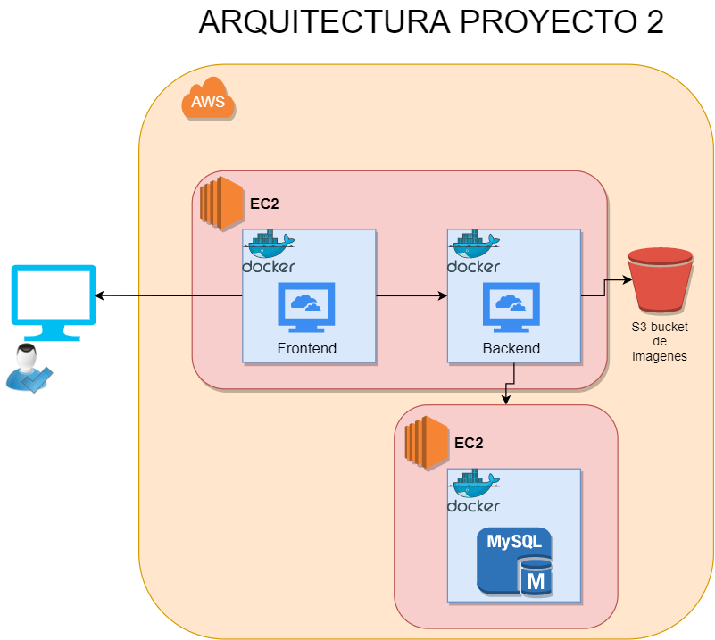

# Semi1-29-Proyecto2

**UNIVERSIDAD DE SAN CARLOS DE GUATEMALA** 
**FACULTAD DE INGENIERÍA** 
**ESCUELA DE INGENIERÍA EN CIENCIAS Y SISTEMAS** 
**SEMINARIO DE SISTEMAS 1** 
**SECCIÓN O** 

 
 

 
  

**Grupo:** 29 
| Nombre                             | Carné     |
|------------------------------------|-----------|
| Juan Antonio Pineda Espino              | 201404405 |

# Arquitectura Implementada

 
  

La aplicacion se construyo con una arquitectura basada en la nube (AWS), haciendo uso de su servicio EC2 para crear maquinas virtuales en las cuales se alojaron distintas partes del proyecto como microservicios utilizando docker.

## FRONTEND

 
  
   
  Para el frontend se utilizo VueJS 3.

 
 
El frontend terminado se implemento y lanzo con un contenedor de docker para asi permitir que la EC2 soportara todo lo referente al framework.

El dockerfile que permitio la construccion de la imagen que contendra el contenedor del frontend puede ser visto en

[Frontend Dockerfile](u-social/Dockerfile)

De esta manera se crea una imagen en docker que despues sera expuesta en el puerto 8080. Permitiendo asi su acceso total a traves de la EC2.

## BACKEND

 
  
   
  El backend fue realizado con NodeJS

 
 

El backend se conecta a una base de datos que se encuentra alojada en un contenedor diferente que se encuentra en una EC2 diferente a donde se encuentra el Frontend y este Backend. 

El Backend tambien realiza la publicacion y obtención de imagenes de un bucket de S3 previamente configurado.
Este servicio (backend) se implemento en una imagen con la ayuda de docker para que la EC2 pudiera correrlo sin problemas junto con el frontend.
 
[Backend Dockerfile](backend/Dockerfile)

## BASE DE DATOS

 
  
   
  Para la base de datos se utilizo una base de datos relacional de MYSQL.

 
 

Esta Base de datos se implemento en una EC2 diferente a la EC2 donde se encuentran los servicios dockerizados del frontend y el backend. 
Para 'dockerizar' esta base de datos simplemente se hizo pull de una imagen ya existente en el repositorio de docker, luego se lanzo y configuro la EC2 para poder acceder al puerto 3306 desde cualquier instancia local de MySQL Workbench 
 

[Setup MySQL Docker](https://phoenixnap.com/kb/mysql-docker-container)

## S3 BUCKET

 
  
   

 
 
 
Para el alojamiento de imagenes se utilizo un bucket de AWS S3. El cual se configuracion dos carpetas distintas para guardar las fotos de perfil y las imagenes de las publicaciones hechas en la aplicacion principal (frontend)

 
  

# Usuarios IAM

 
  

## Administrador_201404405
### Politica Asociada: AdministratorAccess
Este usuario funciona como administador de los servicios de AWS, su politica permite crear usuarios IAM y acceso a cualquier servicio excepto facturacion.
 
## rekognition_201404405
### Politica Asociada: AmazonRekognitionFullAccess
Este usuario tiene acceso total a los servicios de rekognition para reconocimiento de imagen mediante IA.
 
## s3-201404045
### Politica Asociada: AmazonS3FullAccess
La politica que tiene este usuario permite acceso, creacion, modificacion de archivos en S3 mediante programacion, con su llave secreta se puede acceder desde un backend de NodeJS para postear u obtener imagenes.

 ## semi1-translate
### Politica Asociada: TranslateFullAccess
El usuario semi1-translate tiene una politica asociada que permite el acceso total mediante programacion hacia el servicio de Amazon Translate. De esta forma se pueden hacer peticiones a dicho servicio desde un backend de NodeJS utilizando la llave secreta de este usuario.
   

