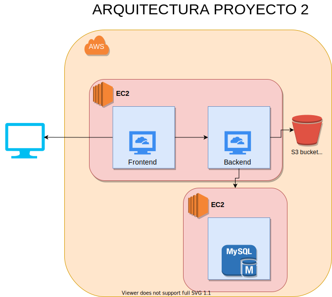

# Semi1-29-Proyecto2

**UNIVERSIDAD DE SAN CARLOS DE GUATEMALA** 
**FACULTAD DE INGENIERÍA** 
**ESCUELA DE INGENIERÍA EN CIENCIAS Y SISTEMAS** 
**REDES DE COMPUTADORAS** 
**SECCIÓN O** 

 
 

 
  

**Grupo:** 29 
| Nombre                             | Carné     |
|------------------------------------|-----------|
| Juan Antonio Pineda Espino              | 201404405 |

## Arquitectura Implementada

 
  

